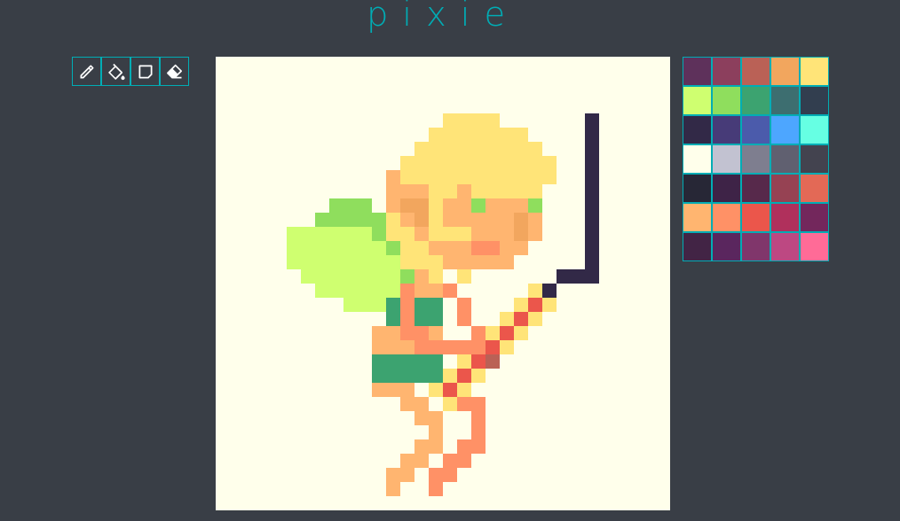

# pixie
> A web based pixelart editor made with react


try [pixie](https://pixie-seapvnk.vercel.app/)

<p align="center">
  
</p>

## Running pixie
````bash
# clone repo
git clone https://github.com/seapvnk/pixie
cd pixie

# install dependencies
yarn install
# or
npm i

# run
yarn start
# or
npm start

# go to http://localhost:3000 to see the pixie running
````

## Roadmap

- [x] Save drawing in png format
- [ ] Save drawing to css (using box-shadow properties)
- [x] ~~Add colorpicker~~
- [x] Switch color palette (import hex palettes)
- [x] Dropper tool to select a color in picture
- [x] Add more tools
